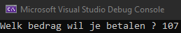
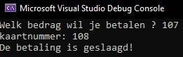

# Testcase {2}

status: ❌
<pre>
Test Case Description:
Gebruiker geeft met mealvouchers een bedrag > 100 (te betalen) in (de betaalterminal)

created by: Tibo Van Gindertaelen
reviewed by:  {name}
version: 2.0
</pre>

## Preconditions
| Precondition |
| ------------ |
| <u><b>Gebruiker</b><u/> |
| De gebruiker heeft toegang tot het GUI scherm om een te-betalen-bedrag op te geven |
| De gebruiker heeft toegang tot het GUI scherm om betaalmethode "mealvouchers" te selecteren |
| De gebruiker heeft toegang tot het GUI scherm om het mealvouchers kaartnummer op te geven |
| De gebruiker kan (eerst) een > 100 te-betalen-bedrag invoeren |
| De gebruiker kan (daarna) een kaartnummer invoeren |
| <u><b>Systeem</b><u/> |
| De gebruiker staat bekend als betaler in de codebehind (-> wie voert iets in)  |
| Het betalingsproces verwacht (eerst) een input die bekend staat als het te-betalen-bedrag in de codebehind (-> wat wordt ingevoerd)  |
| Het betalingsproces verwacht (daarna) een input die bekend staat als het mealvouchers kaartnummer in de codebehind (-> wat wordt ingevoerd)  |
| <u><b>Requirement Logica</b><u/> |
| Het beschikbare budget voor mealvouchers zijn de laatste 3 cijfers van het kaartnummer  |

## Test Data
| Field      | Value   |
| ---------- | ------- |
| te-betalen-bedrag | 107 |
| kaartnummer | 108 |

## Test Steps
| Step | Step detail | Expected Result | Actual Result |
| ---- | ----------- | --------------- | ------------- |
| 1    | Navigeer naar GUI scherm voor input te-betalen-bedrag (a.k.a. start app) | Te-betalen-bedrag input GUI | Te-betalen-bedrag input GUI |
| 2    | Input het te-betalen-bedrag als "107"  | Doorstroom naar betalingsmethode GUI scherm | Doorstroom naar betalingsmethode GUI scherm |
| 3    | Selecteer betalingsmethode als "mealvouchers"  | Doorstroom naar mealvoucher GUI scherm | Doorstroom naar mealvoucher GUI scherm |
| 4    | Input het kaartnummer als "108"  | Foutmelding: Te-betalen-bedrag is groter dan 100 | Bericht: "De betaling is geslaagd!" |

## Bevindingen

De input kon correct ingegeven worden (FOUT): 
 
Probleem -> Te-betalen-bedrag wordt al ingelezen, nog voor selectie betaalmethode de impliciete requirements kenbaar maakt

De foutieve betaling werd geaccepteerd (FOUT): 
 
Requirement -> Als maaltijdcheques uitgever wil ik enkel betalingen toelaten met een bedrag lager dan 100 euro