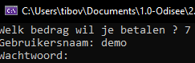
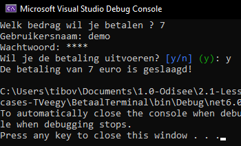

# Testcase {5}

status: ✔️
<pre>
Test Case Description:
Gebruiker doet een correcte inlogpoging bij een inlog-betalingsmethode (Paypal)

created by: Tibo Van Gindertaelen
reviewed by:  {name}
version: 1.0
</pre>

## Preconditions
| Precondition |
| ------------ |
| <u><b>Gebruiker</b><u/> |
| De gebruiker heeft toegang tot het GUI scherm om een te-betalen-bedrag op te geven |
| De gebruiker heeft toegang tot het GUI scherm om betaalmethode "paypal" te selecteren |
| De gebruiker heeft toegang tot het GUI scherm om de paypal username op te geven |
| De gebruiker heeft toegang tot het GUI scherm om het paypal password op te geven |
| De gebruiker kan (eerst) een te-betalen-bedrag invoeren |
| De gebruiker kan (daarna) een username invoeren |
| De gebruiker kan (daarna) een password invoeren |
| <u><b>Systeem</b><u/> |
| De gebruiker staat bekend als betaler in de codebehind (-> wie voert iets in)  |
| Het betalingsproces verwacht (eerst) een input die bekend staat als het te-betalen-bedrag in de codebehind (-> wat wordt ingevoerd)  |
| Het betalingsproces verwacht (daarna) een input die bekend staat als de paypal username in de codebehind (-> wat wordt ingevoerd)  |
| Het betalingsproces verwacht (daarna) een input die bekend staat als het paypal password in de codebehind (-> wat wordt ingevoerd)  |
| <u><b>Requirement Logica</b><u/> |
| De enige correcte username-en-password combinatie is respectievelijk "demo" en "demo" |

## Test Data
| Field      | Value   |
| ---------- | ------- |
| te-betalen-bedrag | 7 |
| username | demo |
| password | demo |

## Test Steps
| Step | Step detail | Expected Result | Actual Result |
| ---- | ----------- | --------------- | ------------- |
| 1    | Navigeer naar GUI scherm voor input te-betalen-bedrag (a.k.a. start app) | Te-betalen-bedrag input GUI | Te-betalen-bedrag input GUI |
| 2    | Input het te-betalen-bedrag als "7"  | Doorstroom naar betalingsmethode GUI scherm | Doorstroom naar betalingsmethode GUI scherm |
| 3    | Selecteer betalingsmethode als "paypal"  | Doorstroom naar paypal GUI scherm | Doorstroom naar paypal GUI scherm |
| 4    | Input de username als "demo"  | Voorlopig geen onderbreking | Voorlopig geen onderbreking |
| 5    | Input het password als "demo"  | Melding: betaling is duidelijk geslaagd | Duidelijke melding dat betaling geslaagd is |

## Bevindingen

De input kon correct ingegeven worden (GOED): 
 

De username kon correct ingegeven worden (GOED): 
 

Het password is correct en de betaling wordt duidelijk bevestigd (GOED): 
 
Requirement -> Als gebruiker wil ik dat de betaling duidelijk slaagt bij het ingeven van de correcte informatie