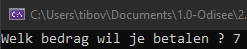
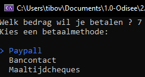

# Testcase {3}

status: ❌
<pre>
Test Case Description:
Gebruiker wil tijdens een betaling het process stoppen.

created by: Tibo Van Gindertaelen
reviewed by:  {name}
version: 1.0
</pre>

## Preconditions
| Precondition |
| ------------ |
| <u><b>Gebruiker</b><u/> |
| De gebruiker heeft toegang tot het GUI scherm om een te-betalen-bedrag op te geven |
| De gebruiker heeft toegang tot het GUI scherm om betaalmethode te selecteren |
| De gebruiker kan (eerst) een te-betalen-bedrag invoeren |
| <u><b>Systeem</b><u/> |
| De gebruiker staat bekend als betaler in de codebehind (-> wie voert iets in)  |
| Het betalingsproces verwacht (eerst) een input die bekend staat als het te-betalen-bedrag in de codebehind (-> wat wordt ingevoerd)  |

## Test Data
| Field      | Value   |
| ---------- | ------- |
| te-betalen-bedrag | 7 |

## Test Steps
| Step | Step detail | Expected Result | Actual Result |
| ---- | ----------- | --------------- | ------------- |
| 1    | Navigeer naar GUI scherm voor input te-betalen-bedrag (a.k.a. start app) | Te-betalen-bedrag input GUI | Te-betalen-bedrag input GUI |
| 2    | Input het te-betalen-bedrag als "107"  | Doorstroom naar betalingsmethode GUI scherm | Doorstroom naar betalingsmethode GUI scherm |
| 3    | Beslis om de betaling te stoppen  | Doorstroom naar betaling annuleren situatie GUI scherm | Niet geimplementeerd |

## Bevindingen

De input kon correct ingegeven worden (GOED): 
 

Gebruiker heeft geen weg uit betaling (FOUT): 
 
Requirement -> Als gebruiker wil ik een betaling steeds kunnen stoppen