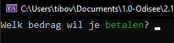
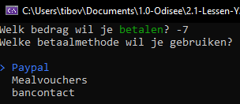

# Testcase {1}

status: ❌
<pre>
Test Case Description:
Verkoper geeft een negatief (te betalen) bedrag in (de betaalterminal)

created by: Tibo Van Gindertaelen
reviewed by:  {name}
version: 3.0
</pre>

## Preconditions
| Precondition |
| ------------ |
| <u><b>Gebruiker</b><u/> |
| De gebruiker heeft toegang tot het GUI scherm om een te-betalen-bedrag op te geven |
| <u><b>Systeem</b><u/> |
| De gebruiker staat bekend als verkoper in de codebehind (-> wie voert iets in)  |
| Het betalingsproces verwacht een input die bekend staat als het te-betalen-bedrag in de codebehind (-> wat wordt ingevoerd)  |
| De gebruiker kan een negatief te-betalen-bedrag invoeren  |

## Test Data
| Field      | Value   |
| ---------- | ------- |
| te-betalen-bedrag | -7 |

## Test Steps
| Step | Step detail | Expected Result | Actual Result |
| ---- | ----------- | --------------- | ------------- |
| 1    | Navigeer naar GUI scherm voor input te-betalen-bedrag (a.k.a. start app) | Te-betalen-bedrag input GUI | Te-betalen-bedrag input GUI |
| 2    | Input het foutieve te-betalen-bedrag als "-7"  | Foutmelding: negatieve input is foutief | Doorstroom naar betalingsmethodes GUI scherm |

## Bevindingen
De input kon correct ingegeven worden (GOED): 

De input werd niet correct behandeld (FOUT): 
 
Requirement -> Als verkoper wil ik enkel positieve bedragen kunnen ingeven